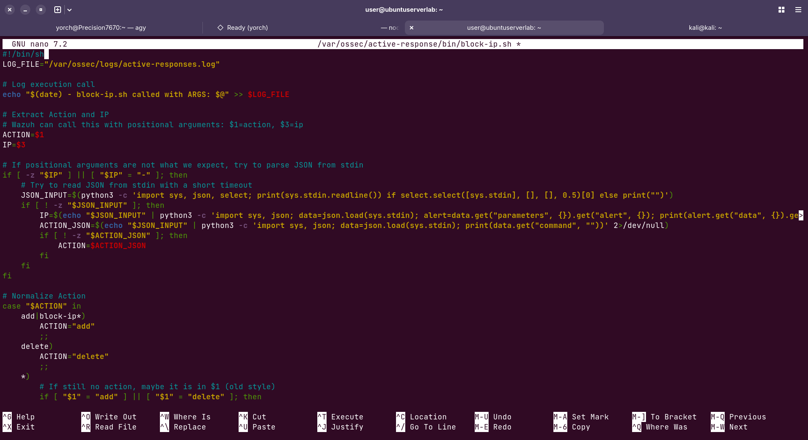

# images

Descripción: Configurar Wazuh para que, al detectar ataques SSH por fuerza bruta, ejecute un script custom block-ip.sh que bloquee automáticamente la IP atacante en iptables sobre el endpoint Ubuntu.
Estado: Listo

Durante la implementación del Active Response en Wazuh, el script por defecto `firewall-drop` no se comportó de forma confiable en el endpoint Ubuntu. Aunque el firewall local (`iptables`) funcionaba correctamente de manera manual, la automatización no lograba bloquear la IP atacante de forma consistente, y en los logs solo se observaban intentos de ejecución parciales o comandos que no completaban el flujo esperado.

Para resolverlo, se cambió la estrategia a un enfoque más controlado y predecible: un **script custom** llamado `block-ip.sh`. Esta metodología permitió eliminar dependencias ambiguas del binario por defecto, controlar explícitamente la lectura de argumentos, normalizar las acciones `add` y `delete`, y asegurar la integración con `iptables` de manera directa. Además, se añadió una regla personalizada en Wazuh para que la contención también fuera visible en el dashboard.

[Ver Issue #19376 wazuh/wazuh](https://github.com/wazuh/wazuh/issues/19376)

Esta solución fue elegida porque ofrece:

- mayor estabilidad en el laboratorio,
- mejor trazabilidad en logs,
- compatibilidad con el formato de ejecución de Wazuh,
- y una forma clara de documentar la contención como un evento visible en la interfaz.

El active response no funcionaba porque:

- El script original se quedaba esperando entrada y no terminaba bien.
- El comando enviado por Wazuh podía llegar con nombre dinámico tipo `block-ip180`.
- Había configuración duplicada o conflictiva en el agente.

La solución fue reemplazarlo por un script más robusto, capaz de:

- Leer entrada de forma segura.
- Aceptar formato JSON de Wazuh 4.x.
- Aceptar argumentos posicionales.
- Normalizar comandos como `block-ip180` a `add`.

**Paso 1: Crear el script custom en el agente Ubuntu víctima**

En el Ubuntu víctima (`192.168.50.10`), crea el script de bloqueo:

```jsx
sudo nano /var/ossec/active-response/bin/block-ip.sh
```

Pega exactamente esto:

```jsx
#!/bin/sh
LOG_FILE="/var/ossec/logs/active-responses.log"

# Log execution call
echo "$(date) - block-ip.sh called with ARGS: $@" >> $LOG_FILE

# Extract Action and IP
# Wazuh can call this with positional arguments: $1=action, $3=ip
ACTION=$1
IP=$3

# If positional arguments are not what we expect, try to parse JSON from stdin
if [ -z "$IP" ] || [ "$IP" = "-" ]; then
    # Try to read JSON from stdin with a short timeout
    JSON_INPUT=$(python3 -c 'import sys, json, select; print(sys.stdin.readline()) if select.select([sys.stdin], [], [], 0.5)[0] else print("")')
    if [ ! -z "$JSON_INPUT" ]; then
        IP=$(echo "$JSON_INPUT" | python3 -c 'import sys, json; data=json.load(sys.stdin); alert=data.get("parameters", {}).get("alert", {}); print(alert.get("data", {}).get("srcip", alert.get("srcip", "")))' 2>/dev/null)
        ACTION_JSON=$(echo "$JSON_INPUT" | python3 -c 'import sys, json; data=json.load(sys.stdin); print(data.get("command", ""))' 2>/dev/null)
        if [ ! -z "$ACTION_JSON" ]; then
            ACTION=$ACTION_JSON
        fi
    fi
fi

# Normalize Action
case "$ACTION" in
    add|block-ip*)
        ACTION="add"
        ;;
    delete)
        ACTION="delete"
        ;;
    *)
        # If still no action, maybe it is in $1 (old style)
        if [ "$1" = "add" ] || [ "$1" = "delete" ]; then
            ACTION=$1
        else
            echo "$(date) - block-ip.sh error: unknown action ($ACTION)" >> $LOG_FILE
            exit 1
        fi
        ;;
esac

# Final check for IP
if [ -z "$IP" ] || [ "$IP" = "None" ]; then
    echo "$(date) - block-ip.sh error: IP not found" >> $LOG_FILE
    exit 1
fi

echo "$(date) - block-ip.sh processing: ACTION=$ACTION, IP=$IP" >> $LOG_FILE

# Execute iptables command
if [ "$ACTION" = "add" ]; then
    /sbin/iptables -C INPUT -s "$IP" -j DROP 2>/dev/null || /sbin/iptables -I INPUT -s "$IP" -j DROP
elif [ "$ACTION" = "delete" ]; then
    /sbin/iptables -D INPUT -s "$IP" -j DROP 2>/dev/null
fi

exit 0

```

El script debe:

- Tomar `ACTION` e IP.
- Si `ACTION=add`, insertar la regla:
    
    `bashiptables -I INPUT -s "$IP" -j DROP`
    
- Si `ACTION=delete`, remover la regla:
    
    `bashiptables -D INPUT -s "$IP" -j DROP`
    

Además, debe soportar:

- entrada JSON de Wazuh 4.x,
- argumentos posicionales tradicionales,
- comandos dinámicos como `block-ip180`.



Guarda y aplica permisos correctos:

```jsx
sudo chmod 750 /var/ossec/active-response/bin/block-ip.sh
sudo chown root:wazuh /var/ossec/active-response/bin/block-ip.sh
```

---

**Paso 2: Configurar el Active Response en el Wazuh Manager**

En el Manager (`10.11.147.221`), edita `/var/ossec/etc/ossec.conf`

Localiza la sección `<!-- Active response -->` y reemplaza o agrega los bloques `<command>` y `<active-response>` así. Asegúrate de que **no estén dentro de comentarios** (`<!-- ... -->`):


```xml
<!-- Active response -->
<command>
  <name>block-ip</name>
  <executable>block-ip.sh</executable>
  <timeout_allowed>yes</timeout_allowed>
</command>
```


```xml
<active-response>
  <disabled>no</disabled>
  <command>block-ip</command>
  <location>local</location>
  <rules_id>5710,5763</rules_id>
  <timeout>60</timeout>
</active-response>
```

> **Importante: El bloque anterior que usaba `firewall-drop` queda obsoleto en tu entorno. Puedes comentarlo o eliminarlo para evitar conflictos.**
> 

---

**Paso 3: Agregar una rule_id a block-ip**

1. Entra al Wazuh Dashboard, dirígete a Server Management > Rules. Ahí podrás añadir la regla local sin tocar primero reglas del sistema.
2. Crea una regla local con:
    - **ID**: por ejemplo `100200`
    - **Level**: `10`
    - **Description**: `Wazuh Active Response: IP blocked by block-ip.sh`
        
        ```xml
        <group name="custom_active_response,">
          <rule id="100200" level="10">
            <match>block-ip.sh processing: ACTION=add</match>
            <description>Wazuh Active Response: IP blocked by block-ip.sh</description>
          </rule>
        </group>
        ```
        
    
    Si la interfaz te pide un patrón, usa algo como:
    
    - `block-ip.sh processing: ACTION=add`  o `Starting with ACTION=add`
    
    La documentación de Wazuh indica que las reglas custom se guardan en `local_rules.xml` y luego el manager debe reiniciarse para aplicarlas.
    
    
    
3. Si la interfaz te deja elegir fuente o decoder, usa el log de active response o una regla basada en el contenido de `active-responses.log`  .Si no te deja hacerlo todo desde la UI, la UI normalmente solo te ayuda a editar la regla, pero el archivo real queda en `/var/ossec/etc/rules/local_rules.xml`
4. Después de guardar la regla, reinicia el manager:
    
    ```bash
    sudo systemctl restart wazuh-manager
    ```
    
    La documentación de Wazuh insiste en reiniciar para que la regla custom se active.
    

---

**Paso 4: Reiniciar el agente en el Ubuntu víctima**

Para que el agente reconozca el nuevo script disponible:

```xml
sudo systemctl restart wazuh-agent
sudo systemctl status wazuh-agent --no-pager
```

---

**Paso 5: Prueba de fuego — emular el ataque desde Kali**

**Desde Kali Linux**, lanza el ataque con menos hilos para que las alertas lleguen ordenadas:

```bash
hydra -l voldemort -P passwords.txt -t 4 192.168.50.10 ssh
```

**Mientras Hydra corre**, en otra terminal de Kali verifica que te bloquean:

```bash
ping 192.168.50.10
```

Deberías ver cómo el ping deja de responder en los primeros minutos del ataque. Si quieres ver el bloqueo en tiempo real desde el agente, en el Ubuntu víctima ejecuta:

```bash
sudo tail -f /var/ossec/logs/active-responses.log
```


El ataque no concluyó porque el comando agregado **block-ip** se lanzó de forma satisfactoria.

**Visualizar la contención en el Dashboard**

Ve a tu panel web de Wazuh → **Security Events**.

Busca estas dos alertas en orden:

| **Regla** | **Descripción** | **Qué significa** |
| --- | --- | --- |
| **5710** | `sshd: Attempt to login using a non-existent user` | Cada intento de Hydra con usuario `voldemort` |
| **10200** | `Wazuh Active Response: IP blocked by block-ip.sh` | Wazuh ejecutó `block-ip.sh` y bloqueó la IP de Kali |

La alerta **10200** confirma que el Active Response con el script personalizado se disparó exitosamente.


[Legacy - Using a custom script](https://app.notion.com/p/Legacy-Using-a-custom-script-36b73deeee7180aa98e8d09d6c86bf48?pvs=21)