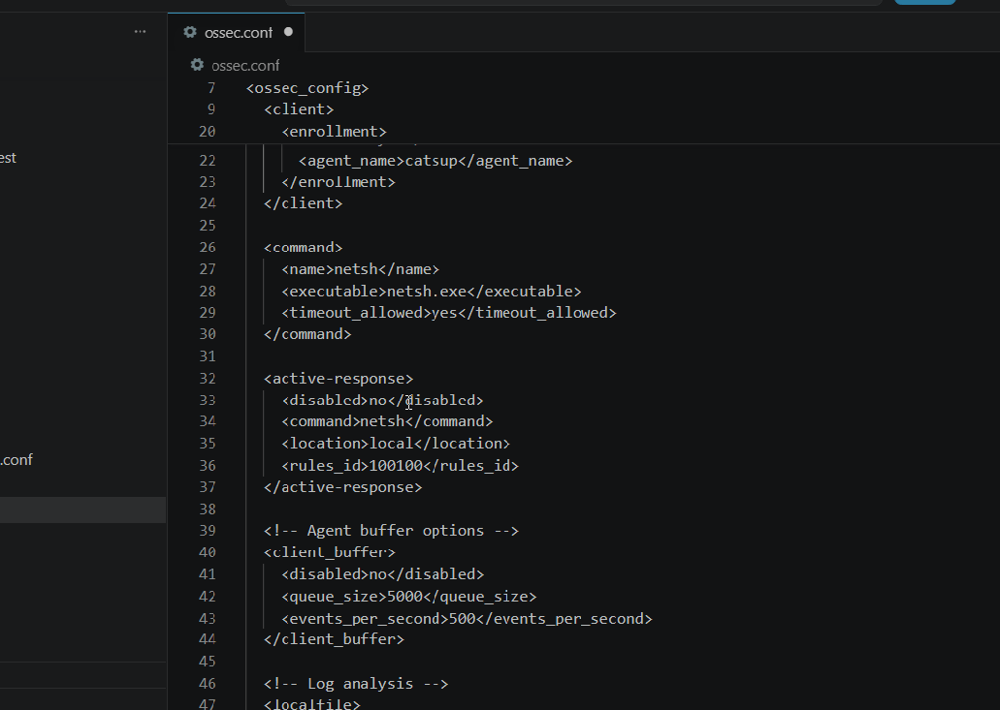

# Bloqueo de ataques de fuerza bruta por RDP (Windows).md

Descripción: Crear una regla personalizada en Wazuh (Regla 100100) que detecte ataques hacia el Escritorio Remoto (RDP) si ocurren 3 fallos de inicio de sesión en una ventana de 120 segundos. Se utilizará el script nativo netsh.exe para bloquear la IP del atacante en el firewall de Windows
Estado: Listo

**Paso 1: Configurar el Agente de Windows**

Debemos habilitar el comando de respuesta activa localmente en el agente de Windows indicándole qué script debe ejecutar al recibir la orden.

1. Ingresa a tu máquina Windows y abre el archivo de configuración del agente en la ruta: **`C:\Program Files (x86)\ossec-agent\ossec.conf`**.
2. Agrega los bloques **`<command>`** y **`<active-response>`** dentro del archivo:
    
    
    
3. Guarda el archivo y reinicia el servicio del agente de Wazuh en Windows (puedes hacerlo desde la interfaz gráfica del Wazuh Agent Manager o usando los servicios de Windows).
    
    
    

**Paso 2: Crear la regla personalizada y configurar el Wazuh Manager**

Ahora le enseñaremos al manager a detectar específicamente 3 fallos de RDP en 120 segundos y le daremos la orden de disparar el script **`netsh`**.

1. Entra a la terminal de tu contenedor/servidor **Wazuh Manager**.
2. Edita el archivo de reglas locales: **`sudo nano /var/ossec/etc/rules/local_rules.xml`**.
3. Agrega la siguiente regla personalizada (Regla 100100):
    
    
    
    *(Nota técnica: Esta regla evalúa el **<if_matched_sid>60122**, el cual rastrea múltiples IDs de eventos de Windows relacionados con fallos de inicio de sesión)*.
    
4. Abre el archivo de configuración principal del manager: **`sudo nano /var/ossec/etc/ossec.conf`**.
    
    
    
5. Agrega exactamente los mismos bloques **`<command>`** y **`<active-response>`** que pusiste en el agente de Windows para que el manager sepa cómo enrutar la orden:
    
    
    
6. Guarda los cambios y reinicia el manager: **`sudo systemctl restart wazuh-manager`**.

**Paso 3: Prueba de fuego (Emular el ataque RDP)**

1. Desde tu máquina atacante (Kali Linux), abre la terminal.
2. Ejecuta el siguiente comando con Hydra para lanzar un ataque de fuerza bruta contra el puerto RDP
    
    
    
    *(Nota: Puedes cambiar "roger" por algún otro nombre de usuario de Windows que quieras probar, y asegúrate de tener un diccionario llamado "passwords.txt" válido en tu directorio actual)*.
    

**Paso 4: Visualizar las alertas y comprobar el bloqueo**

1. Ve a tu panel web de Wazuh y entra al módulo de **Security events**.
2. Al revisar los eventos recientes, verás que se detona la **Regla 100100** con la descripción *"Possible RDP attack: 3 failed logins in a short period of time"* desde la IP del servidor atacado.
    
    
    
3. Inmediatamente después, se generará una nueva alerta de respuesta activa que confirmará que se ha usado la línea de comandos **`netsh`** para agregar la IP del atacante a la lista de bloqueo del firewall local en Windows.
    
    
    
4. Para comprobar que el bloqueo fue exitoso en la vida real, intenta conectarte manualmente por RDP desde tu Kali a la máquina Windows. El cliente de Escritorio Remoto debería darte un error de conexión, indicando que el acceso ha sido denegado por restricciones de red
    
    
    
    Esto es exactamente el comportamiento esperado: Wazuh disparó la alerta **"Possible RDP attack: 3 failed logins"** y automáticamente bloqueó la IP con `netsh advfirewall`. El rule ID `92043` confirma que es tu regla personalizada de detección de fuerza bruta RDP. El otro error solo es por no estar en vista gráfica, pero el log de fallo de conexión llegó antes del error por sesión gráfica.
